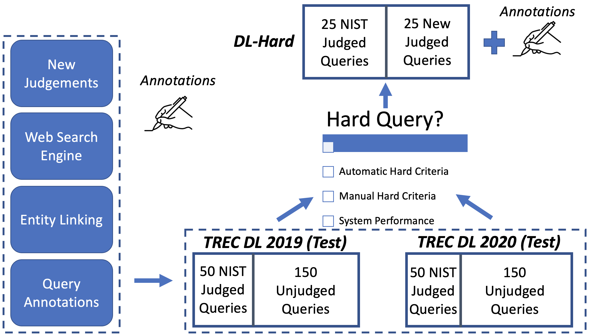

Deep Learning Hard (DL-HARD) is a new annotated dataset building upon standard deep learning benchmark evaluation datasets. It builds on TREC Deep Learning (<a href="https://microsoft.github.io/msmarco/TREC-Deep-Learning-2020.html">DL</a>) questions extensively annotated with query intent categories, answer types, wikified entities, topic categories, and result type metadata from a leading web search engine. Based on this data, we introduce a framework for identifying challenging questions. DL-HARD contains 50 queries from the official 2019/2020 evaluation benchmark, half of which are newly and independently assessed. We perform experiments using the official submitted runs to DL on DL-HARD and find substantial differences in metrics and the ranking of participating systems. Overall, DL-HARD is a new resource that promotes research on neural ranking methods by focusing on challenging and complex queries.

Preprint: <a href="https://arxiv.org/abs/2105.07975">link</a>

Github: <a href="https://github.com/grill-lab/DL-Hard">link</a> 

