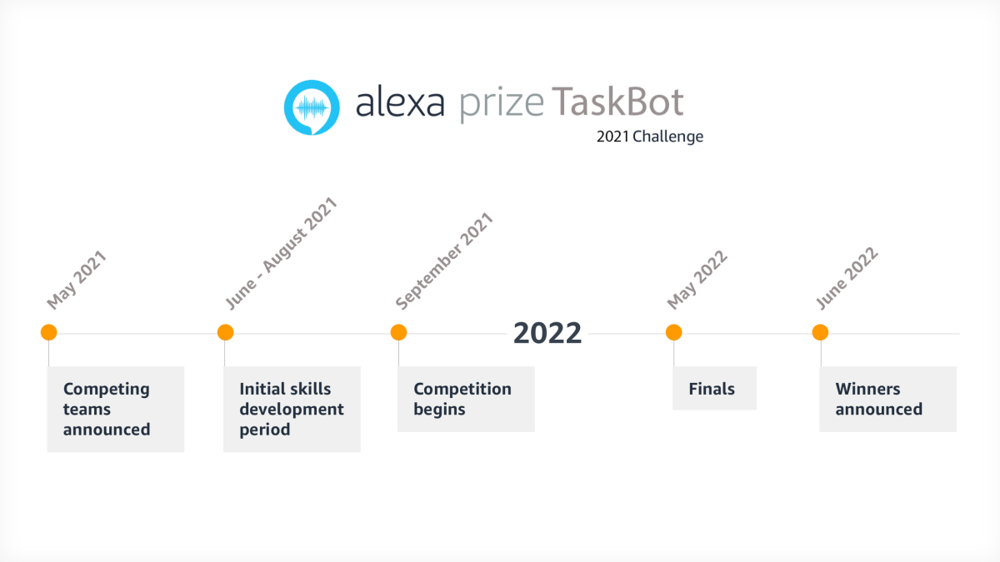
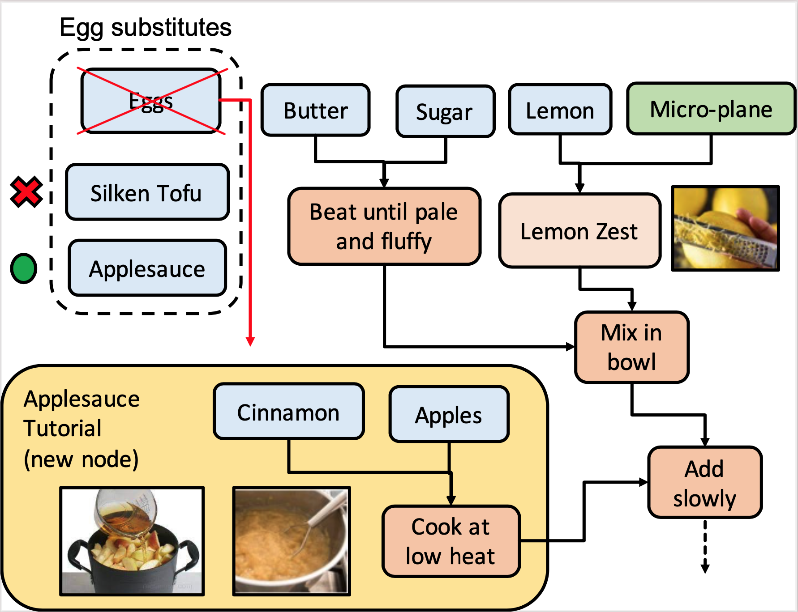

<strong>Alexa TaskBot Challenge</strong>

GRILL is one of just ten teams chosen by Amazon from more than 125 entries across 15 countries to 
compete in the first Alexa Taskbot Challenge (<a href="https://www.amazon.science/academic-engagements/ten-university-teams-selected-to-participate-in-alexa-prize-taskbot-challenge">link</a>). 
The Glasgow team will receive a research grant of $250,000 (£176,500) to 
help them over the next 12 months. They will also receive four Amazon Alexa devices, free access to Amazon Web Services, 
and support from members of the Amazon Alexa team. 

The GRILL team consists of School of Computing Science graduate students Sophie Fischer, Carlos Gemmell, Iain Mackie, 
Paul Owoicho, and Federico Rossetto. Dr. Jeff Dalton is the team’s faculty advisor and will help guide the project.  
Jeff is also a former Masterchef contestant appearing on the American version of the popular cooking program in 2011.

The team’s leader, Carlos Gemmell, said: “We’re thrilled that our entry was successful and we’re excited to begin work 
on the Alexa Taskbot project.” 
 
“Over the next 12 months, we’ll develop novel multimodal deep learning algorithms grounded in tasks that people do in 
the real world. It will be capable of understanding what users require when performing a task and how to guide them 
through it by reasoning over past interactions, a structured representation of the task, and curated documents.” 
 
“The project aims to develop new conversational question answering technology specialized for complex tasks using 
state-of-the-art neural deep learning models. Having access to Alexa users around the world will allow us to receive 
real-time feedback and help us to make it an invaluable task assistant.”

GRILL will be going head-to-head against 9 of the best conversational AI groups in the world, including: Carnegie Mellon University,
National Taiwan University (NTU), NOVA School of Science and Technology (Portugal), Ohio State University,
Texas A&M University, University College London, University of California Santa Barbara, University of Massachusetts (Amherst), 
and University of Pennsylvania.

<strong>Vision</strong>

Imagine a future where you carefully planned a dinner party and
a friend shows up at the last minute who is vegetarian and hates
mushrooms. It throws your menu with chicken and mushroom
risotto into chaos. You need to stay calm and adapt. 

Luckily, GRILL's virtual assistant is there to help. 
It can find a new recipe especially for them
based on what you have or appropriate substitutions for your meal
without compromising the menu. If you make a mistake, the agent
is there to help you recover. Even better, it could actively assist
you by preventing common mistakes in the first place. 

The Taskbot understands what you’re doing and how you’re doing it by grounding 
the conversation in domain knowledge and a task model. It is
capable of clearly explaining the reason for adding cornstarch to
your scrambled eggs and helping you diagnose your failed sourdough bread. 
Although this is an ambitious vision beyond current
capability, our team will make key advances towards this goal with
multi-modal and visually grounded conversation capability.

<strong>Research</strong>

Our scientific approach to the TaskBot challenge comes from our team’s background in the fields of Information Retrieval 
and Information Extraction, with a focus on user-centric modelling of complex information tasks. 
Our approach is based on retrieval, extraction, and question answering on large web corpora and knowledge graphs.

The system we envision is capable of dynamically adapting to new
domains from machine reading of semi-structured documents with
limited or even no human supervision. It should be capable of reasoning over multiple data modalities present in the real world, and
should fluidly guide a user through complex tasks while remaining
open to domain questions. 

This ambitious goal requires us to make
contributions to new neural models for dialogue task structure, new
multi-modal representations that are grounded in text, images, and
video, and new information extraction techniques to automatically
extract task structures from semi-structured documents.

