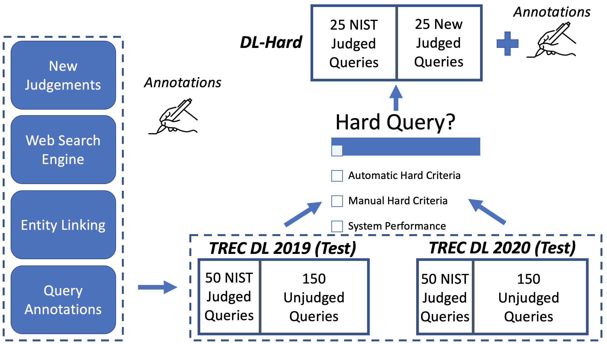

<strong>Overview</strong>

Deep Learning Hard (DL-HARD) is a new annotated dataset building upon standard deep learning benchmark evaluation datasets. It builds on TREC Deep Learning (<a href="https://microsoft.github.io/msmarco/TREC-Deep-Learning-2020.html">DL</a>) questions extensively annotated with query intent categories, answer types, wikified entities, topic categories, and result type metadata from a leading web search engine. 

Based on this data, we introduce a framework for identifying challenging questions. DL-HARD contains 50 queries from the official 2019/2020 evaluation benchmark, half of which are newly and independently assessed. We perform experiments using the official submitted runs to DL on DL-HARD and find substantial differences in metrics and the ranking of participating systems. 

Overall, DL-HARD is a new resource that promotes research on neural ranking methods by focusing on challenging and complex queries.

Preprint: <a href="https://arxiv.org/abs/2105.07975">link</a>, Github: <a href="https://github.com/grill-lab/DL-Hard">link</a> 

<strong>Annotations & Entity Links</strong>

Annotations are provided for 400 queries from the DL 2019/20 test datasets (<a href="https://github.com/grill-lab/DL-Hard/blob/main/annotations/query/annotations.tsv">link</a>). The annotations tsv has the following columns: 
  <ul>
    <li>0: <i>Topic id</i></li>
    <li>1: <i>Query</i></li>
    <li>2: <i>Query Intent</i>: Recently developed question intent taxonomy developed for web questions 
    [<a href="http://marksanderson.org/publications/my_papers/CHIIR21b.pdf">Cambazoglu et al., 2021</a>]. </li>
    <li>3: <i>Answer Type</i>: Manual annotation of target answer type for web questions. </li>
    <li>4: <i>Topic Domain</i>: Breakdown of questions by topic domain. </li>
    <li>5: <i>SERP Result Type</i>: Answer type provided by the Search Engine Results Page (SERP). HTML of queries found: <a href="https://drive.google.com/file/d/1l6o9U9Qtu21MS9F27bkfEbN95yeDsu9S/view?usp=sharing">here</a>. </li>
  </ul>

High-recall results for SOTA entity linkers (REL [<a href="https://arxiv.org/pdf/2006.01969.pdf">Van Hulst et al., 2020</a>], BLINK [<a href="https://www.aclweb.org/anthology/2020.emnlp-main.519/">Wu et al., 2020</a>], GENRE [<a href="https://arxiv.org/abs/2010.00904">De Cao et al., 2020</a>], ELQ [<a href="https://arxiv.org/abs/2010.02413">Li et al., 2020</a>]) are provided for all 400 queries from the DL  2019/20 test datasets. Golden entity links to Wikipedia (2021/02/27) are also provided: <a href="https://github.com/grill-lab/DL-Hard/blob/main/annotations/entity/gold-entity-judgements.json">here</a>. These include annotations: (1) <i>Answer in Link</i>: whether question is answered within linked Wikipedia page, and (2) <i>Core Entities in Wiki</i>: whether any core entities of the question were not found in Wikipedia. 

<strong>Hard Queries</strong>

To differentiate system performance between large neural ranking models new challenging and complex benchmark queries are required. Hard queries were identified within the DL 2019/20 testsets through:

<i>Automatic Hard Criteria</i>: Because manually reviewing all candidate queries is time consuming, we explore the use of annotated metadata only, without requiring knowledge of system effectiveness. Google’s web search answer type as a base with additional List and Reason query intents added to improve recall. Intent types matching Quantity, Weather, and Language (mostly dictionary lookups) are excluded.

<I>Manual Hard Criteria</i>: Each candidate question, generated from Automatic Hard Criteria, is manually labeled by multiple authors and candidate hard queries discussed by all authors. Guidelines include: non-factoid, beyond single passage, answerable, text-focused, mostly well-formed, and possibly complex.

We measure official TREC 2020 document run submissions on DL-HARD overlapping subsets and compare to the original DL Track. On an average relative basis for above-median system, DL-HARD NDCG@10 is 21.1% lower, RR is 23.2% lower, and Recall@100 is 19.6% lower. This included a new top system (‘ICIP_run1’), and each system changed on average 4.6 places. This large number of swaps supports that removing the easier queries allows for a better comparison between state-of-the-art retrieval systems.

Top 20 systems’ effectiveness on DL-HARD compared with DL for the 2020 document ranking task:

<strong>Notebook Examples</strong>

We provide Pyserini () and PyTerrier () Colab Notebooks.

If we take a "hard" query (qid: 915593): <i>what types of food can you cook sous vide</i>. This query is classed as hard because it requires reasoning and the answer contains multiple entities spanning multiple documents.  

Query annotations: 

Entity Links:

The Answer Type of this query is a List. We can view Answer Type performance across DL-HARD early on PyTerrier baselines (passage ranking):

Preprint: <a href="https://arxiv.org/abs/2105.07975">link</a>, Github: <a href="https://github.com/grill-lab/DL-Hard">link</a> 

