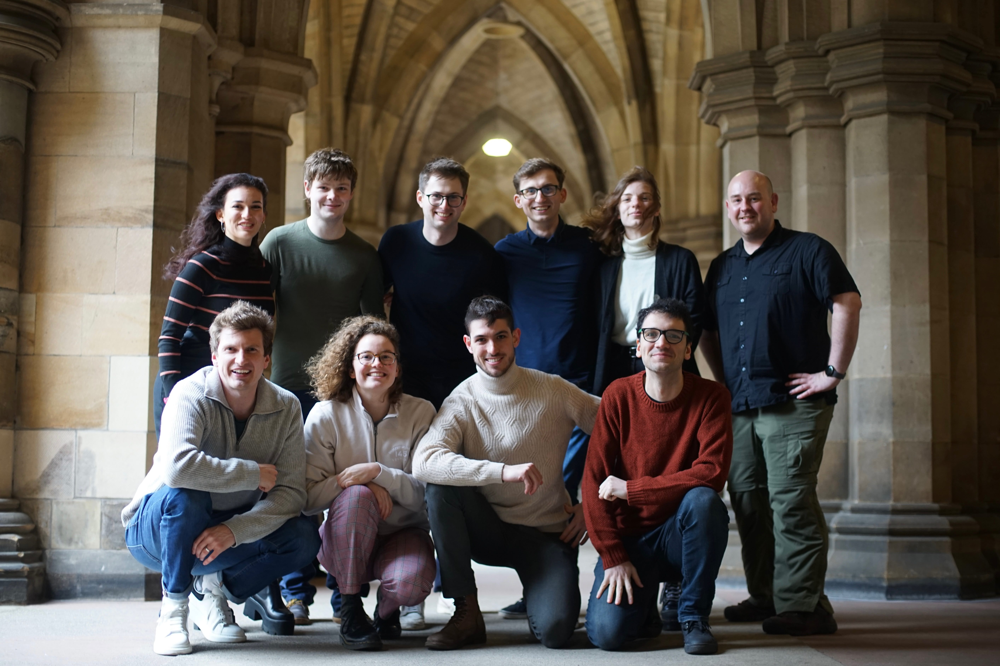

<strong>Amazon Alexa Prize TaskBot Challenge 2</strong>

We're excited to announce that GRILL is returning as one of ten teams selected to 
compete in the second [Alexa Taskbot Challenge](https://www.amazon.science/alexa-prize/taskbot-challenge), read [Amazon's official announcement](https://www.amazon.science/alexa-prize/taskbot-challenge/ten-university-teams-selected-for-alexa-prize-taskbot-challenge-2).
GRILL will be going head-to-head against nine of the leading AI research groups around the world to try to defend the title as the [winning team of last year's TaskBot Challenge](https://www.amazon.science/alexa-prize/taskbot-challenge/2021).

For the second Alexa Prize TaskBot Challenge, the GRILL team consists of School of Computing Science students Iain Mackie, Sophie Fischer, Carlos Gemmell, Federico Rossetto, Ekaterina Terzieva and Daniel Armstrong.
Undergraduate students Niklas Tecklenburg, Philip Zubel and Eva Kupcova are completing the team this year.
Dr. Jeff Dalton is the team’s faculty advisor. 

“The GRILL team were thrilled to win the Alexa Prize TaskBot Challenge last year, and we’re looking forward to competing again this year in a competition that pushes the boundaries of what conversational AI systems can do to help people in the real world.” said faculty advisor Jeff Dalton.

“The team is creating the next generation of open assistants that understand and use knowledge about the world and can communicate effectively to inform and educate. We will make advances in new deep learning models for more advanced question answering, search based on new machine learning methods, and new machine learning models that learn how and when an assistant should proactively interact with people to help them effectively.”

Left to right (back row): Ekaterina Terzieva, Daniel Armstrong, Niklas Tecklenburg, Philip Zubel, Eva Kupcova and Jeff Dalton. Left to right (front row): Iain Mackie, Sophie Fischer, Carlos Gemmell and Federico Rossetto

PhD student Sophie Fischer was part of Team GRILL last year and will lead the team in this year’s challenge. Sophie said: "The TaskBot challenge is a unique opportunity to apply and showcase our research on cutting-edge AI technologies to thousands of users around the world.
Our research team works on new capabilities of foundation models that understand text, images, and the surrounding world.
This year, GRILLBot 2.0. is aiming to be much more entertaining, interactive, and flexible depending on the person it is speaking to. We will soon see if users around the world agree!"

**We're excited to take the latest cutting-edge research in multi-modal deep learning and language understanding out of the lab and into your kitchen again, coming March 2023.** 

The GRILL research lab (independent from the Alexa team) has [multiple open funded PhD and Postdoc opportunities](https://grilllab.ai/openings/) for researchers in neural models for conversational AI. Please [reach out](https://grilllab.ai/contact) or email Dr. Dalton directly. 

**#JoinTheKitchen**
