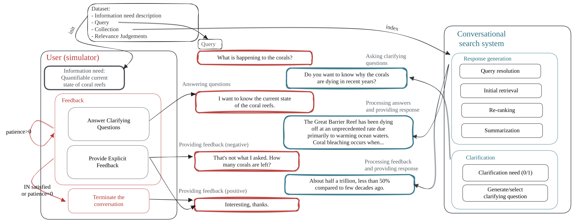
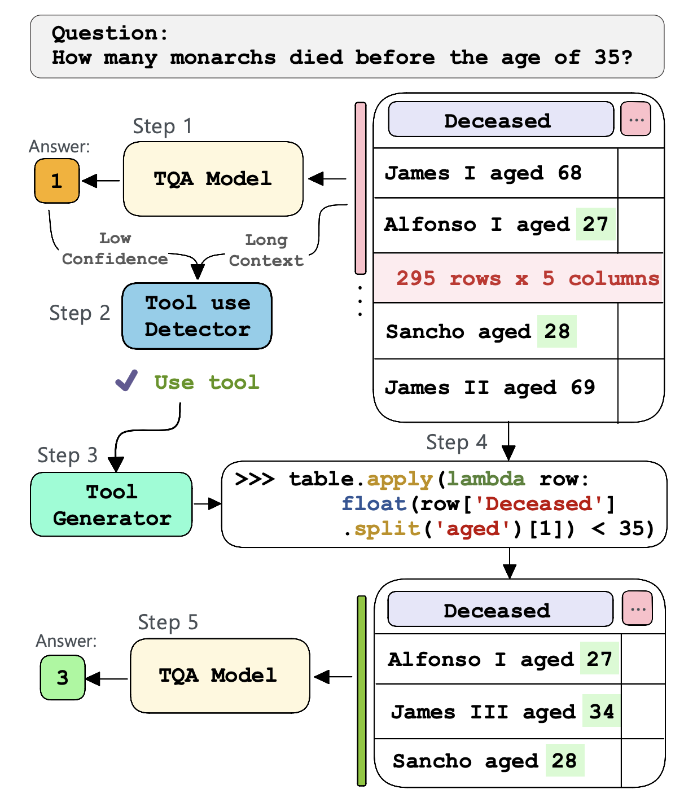

<strong>Freshly Cooked: New GRILL Lab Papers</strong>

This blog post will provide a brief summary of the latest research released by the GRILL Lab. While addressing distinct challenges, such as Search, Conversational AI, and SQL Generation, these papers share a common thread: the utilisation of Large Language Models (LLMs) to enable capabilities that were previously unattainable.

<strong>[1) Generative Relevance Feedback with Large Language Models](https://arxiv.org/pdf/2304.13157)</strong> by <em>Iain Mackie, Shubham Chatterjee, Jeffrey Dalton</em> (SIGIR 2023)

Generative Relevance Feedback (GRF) is a general method that allows neural and non-neural models to contextualise queries based on the text generated from Large Language Models. We show that GRF with probabilistic query expansion models can significantly improve retrieval effectiveness over RM3 expansion. While our [extension preprint](https://arxiv.org/pdf/2305.07477.pdf) shows GRF also improves dense and learned sparse retrieval effectiveness by around 10%. Furthermore, we show you can combine generative with pseudo-relevance feedback signals to achieve “the best of both worlds” and improve recall. Overall, this body of work supports leveraging text content from LLMs to improve core retrieval algorithms. 

<strong>[2) Exploiting Simulated User Feedback for Conversational Search: Ranking, Rewriting, and Beyond](https://arxiv.org/pdf/2304.13874)</strong> by <em>Paul Owoicho, Ivan Sekulić, Mohammad Aliannejadi, Jeffrey Dalton, Fabio Crestani</em> (SIGIR 2023)

This work proposes using a user simulator-based framework for multi-turn interactions with a variety of mixed-initiative conversational systems. Specifically, we leverage LLMs as a user simulator, dubbed ConvSim, that, once initialised with an information need description, is capable of providing explicit feedback to a system's responses, as well as answering potential clarifying questions. Experiments show that utilisation of this user feedback can lead to 16% retrieval performance increase in terms of nDCG@3. We show that LLMs are as good as humans at providing data and significantly cheaper than running a user study. To support further research in the topic, we release over 30,000 transcripts of system-simulator interactions based on well-established conversational search datasets.

<strong>[3) Generate, Transform, Answer: Question Specific Tool Synthesis for Tabular Data](https://arxiv.org/abs/2303.10138)</strong> by <em>Carlos Gemmell, Shubham Chatterjee, Jeffrey Dalton</em> (Preprint)

The paper explores the challenges posed by Tabular Question Answering (TQA), which requires neural systems to combine natural language understanding with extensive semi-structured data. To address this issue, the paper introduces ToolWriter, a novel approach that generates query-specific programs and determines when to apply them to transform tables. By focusing on using row-filtering tools, ToolWriter achieves state-of-the-art performance improvements for WikiTableQuestions and WikiSQL, particularly benefiting from long tables. Overall, this paper demonstrates the headroom and potential of combining programmatic tools with neural components to manipulate large volumes of structured data.
