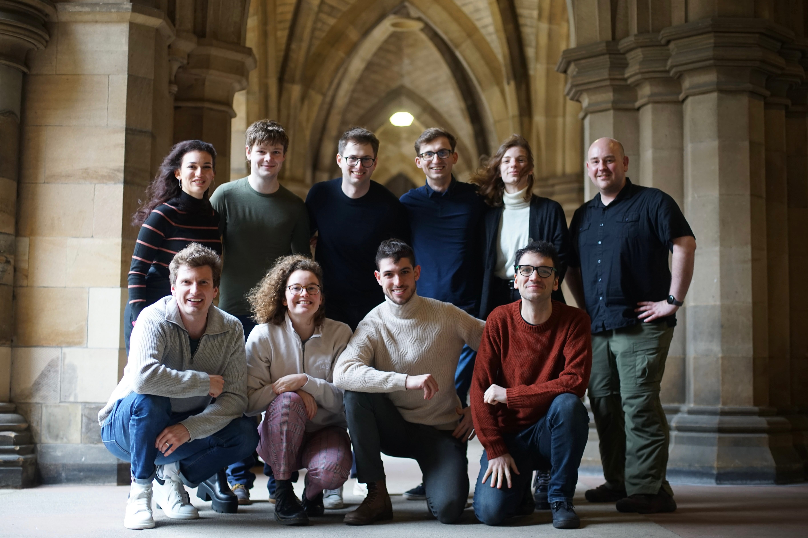

<strong>Amazon Alexa Prize TaskBot Challenge 2</strong>

We are excited to announce Team GRILL won the second Prize in the [Alexa Prize TaskBot Challenge 2](https://www.amazon.science/alexa-prize/taskbot-challenge). 
Our system, called GRILLBot, is a "multi-modal task-oriented digital assistant to guide users through complex real-world tasks".
It helps users with cooking and everyday tasks in the home.
Read more about the competition finals in [Amazon's finals announcement](https://www.amazon.science/alexa-prize/taskbot-challenge/2022).

You can read our system description in the [Amazon Alexa Taskbot Prize proceedings](https://www.amazon.science/alexa-prize/proceedings?q=&f0=00000186-558e-d945-a3c6-7ddf82610000&s=0&expandedFilters=Challenge%2CAuthor%2CYear%2C).
The title of the team's research paper is [GRILLBot-v2: Generative models for multi-modal task-oriented assistance](https://www.amazon.science/alexa-prize/proceedings/grillbot-v2-generative-models-for-multi-modal-task-oriented-assistance).

The GRILL team consists of School of Computing Science Graduate students Sophie Fischer (Team Lead), Ekaterina Terzieva, and Daniel Armstrong.
Undergraduate students Niklas Tecklenburg, Philip Zubel, and Eva Kupcova complete the team.
Iain Mackie, Carlos Gemmell, and Federico Rossetto act as student advisors.
[Dr. Jeff Dalton](http://www.dcs.gla.ac.uk/~jeff/) is the team's faculty advisor. 

Left to right (back row): Ekaterina Terzieva, Daniel Armstrong, Niklas Tecklenburg, Philip Zubel, Eva Kupcova, and Jeff Dalton. Left to right (front row): Iain Mackie, Sophie Fischer, Carlos Gemmell and Federico Rossetto.

A key aspect of the second Alexa Prize TaskBot Challenge was to go beyond just voice to effectively incorporate visual aids fluently.
"Working on the Challenge gave us the unique opportunity to develop and deploy cutting-edge language models.
We learned that it's not just about model size or improved training, but about using models in new and creative ways to help people.
The Challenge is a fun roller coaster because the time from research to real-world deployment is shorter than in most research projects or products. " said Team Lead Sophie Fischer. 

After winning [the title of the inaugural Amazon Alexa TaskBot Challenge](https://www.amazon.science/alexa-prize/taskbot-challenge/2021), the team is thrilled to place second this year.
"We're excited and proud because it means that the GRILL Team's research and the Open Assistant Toolkit are at the forefront of conversational AI. 
Using the latest advances in Large Language Models, GRILLBot creates user experiences that are more natural and helpful by bringing in new types of rich interactions. Like this, we could engage the user and teach them new knowledge and skills. " said Sophie Fischer.

"I'm proud of the team rising to meet new AI research challenges in the second year of the Amazon Alexa TaskBot Challenge. This includes deploying LLMs for social chat, knowledge augmentation, and improving task-specific QA" said faculty advisor Jeff Dalton.
"Placing second demonstrates the world-leading talent and determination of the students and their ability to engage with research. "

Stay tuned for more exciting work from the team!
We will aim to continue pushing the frontier of multi-modal generative language models to new levels.
GRILLBot is based on last year's winning [OAT framework](https://github.com/grill-lab/OAT). Watch this space for more code releases soon!

Users of Alexa in the US can still interact with all five finalist teams' submissions. Just say "Alexa, let's work together" to try them out!

**#JoinTheKitchen**