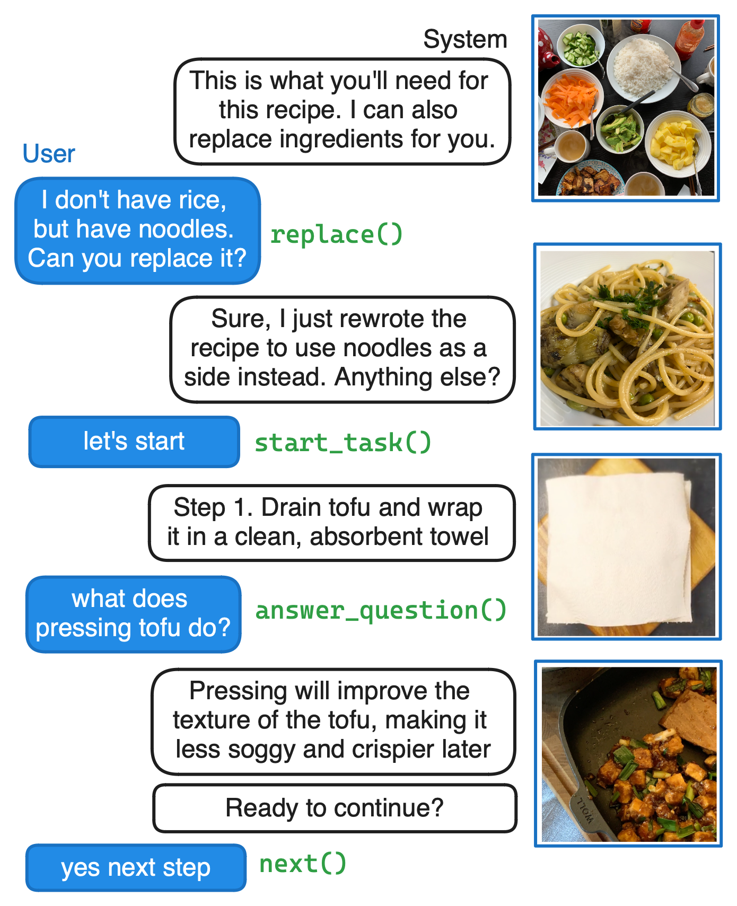
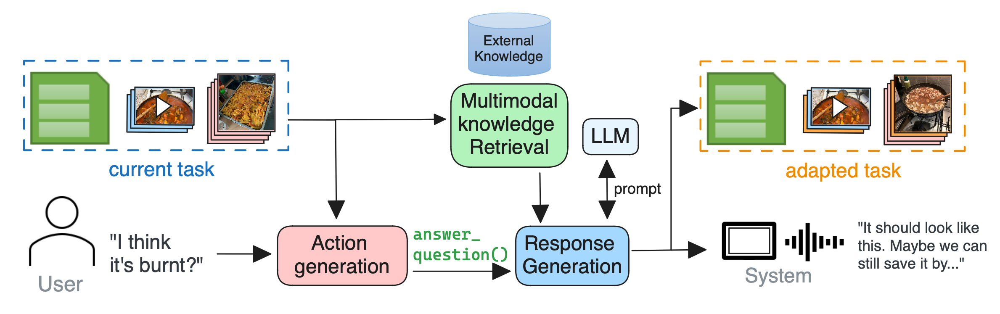
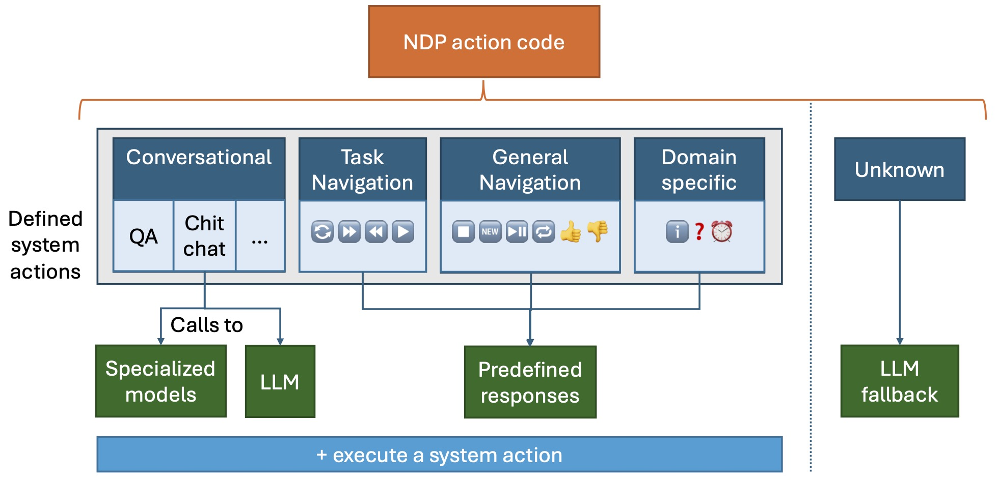

<strong>New GRILL Lab Papers this Spring! Featuring SIGIR, ECIR and KDD accepted papers </strong>

This blog post will provide a brief summary of the latest research released by the GRILL Lab. 
Part 1 contains papers related to GRILLBot, our winning (2022) and second prize (2023) solution for the Alexa Prize TaskBot Challenge.
Part 2 contains papers where we continue to research cutting edge areas in the areas of Information Retrieval and Natural Language Processing. 

<!-- <strong>[Title](Link)</strong> by <em>Authors</em> (Conference)

Summary of the paper -->

#### Part 1: GRILLBot and OAT

<strong>[GRILLBot In Practice: Lessons and Tradeoffs Deploying Large Language Models for Adaptable Conversational Task Assistants](https://arxiv.org/pdf/2402.07647)</strong> by <em>Sophie Fischer, Carlos Gemmell, Niklas Tecklenburg, Iain Mackie, Federico Rossetto, Jeffrey Dalton</em> (KDD '24)

We tackle the challenge of building real-world multimodal assistants for complex real-world tasks. We describe the practicalities and challenges of developing and deploying GRILLBot, a leading (first and second prize winning in 2022 and 2023) system deployed in the Alexa Prize TaskBot Challenge. Building on our Open Assistant Toolkit (OAT) framework, we propose a hybrid architecture that leverages Large Language Models (LLMs) and specialised models tuned for specific subtasks requiring very low latency. OAT allows us to define when, how and which LLMs should be used in a structured and deployable manner. For knowledge-grounded question answering and live task adaptations, we show that LLM reasoning abilities over task context and world knowledge outweigh latency concerns. For dialogue state management, we implement a code generation approach and show that specialised smaller models have 84% effectiveness with 100x lower latency. Overall, we provide insights and discuss tradeoffs for deploying both traditional models and LLMs to users in complex real-world multimodal environments in the Alexa TaskBot challenge. These experiences will continue to evolve as LLMs become more capable and efficient -- fundamentally reshaping OAT and future assistant architectures.

The above image shows an example multimodal conversation with OAT. It showcases how OAT adapts tasks can be adapted and answers questions with system actions by the NDP.

Guess what - you can try out the framework and see all the code writting throughout the Alexa Challenge! Read the next section to find out how.

<strong>[Open Assistant Toolkit -- version 2](https://arxiv.org/abs/2403.00586)</strong> by <em>Sophie Fischer, Federico Rossetto, Carlos Gemmell, Andrew Ramsay, Iain Mackie, Philip Zubel, Niklas Tecklenburg, Jeffrey Dalton</em> (Arxiv)

We present the second version of the Open Assistant Toolkit (OAT-v2), an open-source task-oriented conversational system for composing generative neural models. OAT-v2 is a scalable and flexible assistant platform supporting multiple domains and modalities of user interaction. It splits processing a user utterance into modular system components, including submodules such as action code generation, multimodal content retrieval, and knowledge-augmented response generation. Developed over multiple years of the Alexa TaskBot challenge, OAT-v2 is a proven system that enables scalable and robust experimentation in experimental and real-world deployment. OAT-v2 provides open models and software for research and commercial applications to enable the future of multimodal virtual assistants across diverse applications and types of rich interaction.

OAT-v2 processes user utterances with different submodules. The system generates a system action based on the current task, system state and user utterance. Then, a knowledge-augmented generator generates a response based on the task and external knowledge. The system internally updates the task and responds to the user.

OAT-v2’s composed system for response generation depends on NDP action generation. Depending on the action type, the Orchestrator component handles calling different functionalities such as specialised models, LLMs, or predefined logic flows. If the NDP action code is unknown, a fallback LLM handles generating a fluent response and communicating system abilities to the user.

Feel free to try out the newest OAT release! We release the code [here](https://github.com/grill-lab/OAT).

#### Part 2: IR & NLP research

<strong>[DREQ: Document Re-Ranking Using Entity-based Query Understanding](https://arxiv.org/abs/2401.05939)</strong> by <em>Shubham Chatterjee, Iain Mackie, Jeff Dalton</em> (ECIR'24)

*Note: This paper won the best paper honorable mention award 🏆*

While entity-oriented neural IR models have advanced significantly, they often overlook a key nuance: the varying degrees of influence individual entities within a document have on its overall relevance. Addressing this gap, we present DREQ, an entity-oriented dense document re-ranking model. Uniquely, we emphasize the query-relevant entities within a document's representation while simultaneously attenuating the less relevant ones, thus obtaining a query-specific entity-centric document representation. We then combine this entity-centric document representation with the text-centric representation of the document to obtain a "hybrid" representation of the document. We learn a relevance score for the document using this hybrid representation. Using four large-scale benchmarks, we show that DREQ outperforms state-of-the-art neural and non-neural re-ranking methods, highlighting the effectiveness of our entity-oriented representation approach.

<strong>[Doing Personal LAPS: LLM-Augmented Dialogue Construction for Personalized Multi-Session Conversational Search](https://arxiv.org/abs/2405.03480)</strong> by <em>Hideaki Joko, Shubham Chatterjee, Andrew Ramsay, Arjen P. de Vries, Jeff Dalton, Faegheh Hasibi</em> (SIGIR'24)

The future of conversational agents will provide users with personalized information responses. However, a significant challenge in developing models is the lack of large-scale dialogue datasets that span multiple sessions and reflect real-world user preferences. Previous approaches rely on experts in a wizard-of-oz setup that is difficult to scale, particularly for personalized tasks. Our method, LAPS, addresses this by using large language models (LLMs) to guide a single human worker in generating personalized dialogues. This method has proven to speed up the creation process and improve quality. LAPS can collect large-scale, human-written, multi-session, and multi-domain conversations, including extracting user preferences. When compared to existing datasets, LAPS-produced conversations are as natural and diverse as expert-created ones, which stays in contrast with fully synthetic methods. The collected dataset is suited to train preference extraction and personalized response generation. Our results show that responses generated explicitly using extracted preferences better match user's actual preferences, highlighting the value of using extracted preferences over simple dialogue history. Overall, LAPS introduces a new method to leverage LLMs to create realistic personalized conversational data more efficiently and effectively than previous methods.

<strong>[TREC iKAT 2023: A Test Collection for Evaluating Conversational and Interactive Knowledge Assistants](Link)</strong> by <em>Mohammad Aliannejadi, Zahra Abbasiantaeb, Shubham Chatterjee, Jeffery Dalton, Leif Azzopardi</em> (SIGIR'24)

Conversational information seeking has evolved rapidly in the last few years with the development of Large Language Models (LLMs), providing the basis for interpreting and responding in a naturalistic manner to user requests. The extended TREC Interactive Knowledge Assistance Track (iKAT) collection aims to enable researchers to test and evaluate their Conversational Search Agents (CSA). The collection contains a set of 36 personalized dialogues over 20 different topics each coupled with a Personal Text Knowledge Base (PTKB) that defines the bespoke user personas. A total of 344 turns with approximately 26,000 passages are provided as assessments on relevance, as well as additional assessments on generated responses over four key dimensions: relevance, completeness, groundedness, and naturalness. The collection challenges CSA to efficiently navigate diverse personal contexts, elicit pertinent persona information, and employ context for relevant conversations. The integration of a PTKB and the emphasis on decisional search tasks contribute to the uniqueness of this test collection, making it an essential benchmark for advancing research in conversational and interactive knowledge assistants.

<strong>[Adaptive Latent Entity Expansion for Document Retrieval](https://keirworkshop.github.io/assets/files/keir_1.pdf)</strong> by <em>Iain Mackie, Shubham Chatterjee, Sean MacAvaney, Jeff Dalton</em> (KEIR workshop at ECIR'24)

Despite considerable progress in neural relevance ranking techniques, search engines still struggle to process complex queries effectively—both in terms of precision and recall. Sparse and dense Pseudo-Relevance Feedback (PRF) approaches have the potential to overcome limitations in recall, but are only effective with high precision in the top ranks. In this work, we tackle the problem of search over complex queries using three complementary techniques. First, we demonstrate that applying a strong neural re-ranker before sparse or dense PRF can improve the retrieval effectiveness by 5–8%. Second, we propose an enhanced expansion model, Latent Entity Expansion (LEE), which applies fine-grained word and entity-based relevance modelling incorporating localized features. Specifically, we find that by including both words and entities for expansion achieve a further 2–8% improvement in NDCG. Our analysis also demonstrates that LEE is largely robust to its parameters across datasets and performs well on entity-centric queries. And third, we include an “adaptive” component in the retrieval process, which iteratively refines the re-ranking pool during scoring using the expansion model and avoids re-ranking additional documents. We find that this combination of techniques achieves the best NDCG, MAP and R@ 1k results on the TREC Robust 2004 and CODEC document datasets.