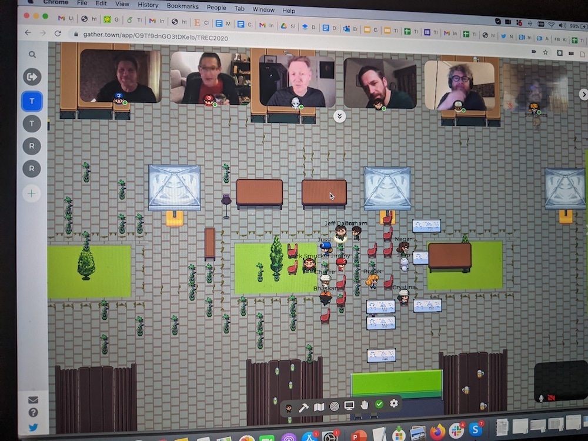

The highlights of TREC 2020 involving the GRILL group include:
 - The TREC Conversation Assistance Track (CAsT) overview talk (Jeff Dalton)
 - Conversational Rewriting for CAsT 2020 invited talk (Carlos Gemmell)
 - Podcast summarization combining abstractive and extractive summarization (Paul Owoicho)
 - CAsT Year three planning
 
 And of course, one of the highlights was the TREC social event in Gather.
 
